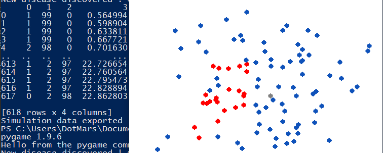

# Pandemic sim

### What ?
  
  - Just like it's name indicates, this program illustrates the spread of a pandemic in a society over-time.
  

### Why ?
  
  - Demonstrate the importance of social distancing in overcoming such an epidemic in a fun way.

### How ?

  - git clone https://github.com/DotMars/Pandemic_sim.git
  - cd to the directory and run : pip freeze > requirements.txt
  - pip install -r requirements.txt
  - Run the simulation using : python covid.py
  - Visualize results saved in data.csv using : python visualize.py
  
### What's next ?
 
  - Simulating going to a central location (bank, groceries etc)
  - Simulating going to multiple locations consistently
  - Adding best case worst case statistics
  - Adding a spread plotter to the side
